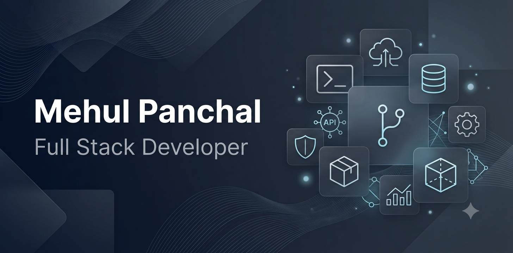

  

<h1 align="center">
Hi 👋, I'm Mehul Panchal
</h1>

<h3 align="center">
Senior Software Engineer • Backend Developer • AWS Certified Cloud Practitioner
</h3>

Building scalable software solutions with clean architecture, modern engineering practices, and a passion for continuous learning.

---

# 👨‍💼 Executive Summary

I'm a **Senior Software Engineer** with professional experience in designing, developing, and maintaining enterprise web applications.

Over the years, I have worked on business-critical applications ranging from admin portals and RESTful APIs to complete web-based management systems. My focus is always on writing maintainable code, delivering reliable software, and creating solutions that solve real business problems.

I believe software engineering is not only about writing code—it's about understanding requirements, designing scalable systems, collaborating effectively with teams, and continuously improving every aspect of the development lifecycle.

---

# 🚀 Professional Journey

✔ Enterprise Web Application Development

✔ Backend Architecture & API Development

✔ Database Design & Optimization

✔ Authentication & Authorization

✔ Performance Optimization

✔ Clean Code & Best Practices

✔ Software Maintenance & Enhancement

✔ Agile Development

✔ Continuous Learning

---

# 🛠 Technical Expertise

## Backend

- PHP
- Laravel
- RESTful API Development

## Frontend

- JavaScript
- Vue.js
- HTML5
- CSS3
- Bootstrap

## Database

- MySQL

## Tools

- Git
- Docker
- Postman

## Cloud

- Amazon Web Services (AWS)

---

# 💡 What I Enjoy Building

I enjoy working on applications that require strong backend architecture and business logic.

Some examples include:

- Enterprise Web Applications
- Admin Dashboards
- HR Management Systems
- CRM Solutions
- REST APIs
- Authentication Systems
- Database-driven Applications
- Business Automation Tools

---

# 🏆 Professional Highlights

- 💼 Professional experience in enterprise software development
- 🚀 Experience building scalable Laravel applications
- 🔐 Secure authentication and authorization implementation
- 📊 Development of responsive admin dashboards
- ⚡ Database optimization and performance tuning
- ☁️ AWS Certified Cloud Practitioner
- 📚 Continuous learner with a passion for modern software engineering

---

# 📜 Certification

🏆 AWS Certified Cloud Practitioner

---

# 📚 Currently Learning

I'm continuously improving my knowledge in:

- Cloud Architecture
- Docker & Containerization
- System Design
- Software Architecture
- Performance Engineering
- Modern Development Practices

---

# 🚀 Featured Projects

## Laravel Admin Dashboard

A modern admin dashboard with authentication, role management, reporting, and responsive UI.

---

## REST API Development

Secure RESTful APIs featuring authentication, validation, structured responses, and third-party integrations.

---

## Human Resource Management System

Enterprise HR platform supporting employee management, attendance, leave management, projects, and reporting.

---

## Portfolio Website

Modern responsive portfolio highlighting projects, skills, certifications, and experience.

---

# 🌟 Development Philosophy

I believe great software comes from:

- Understanding the problem before writing code
- Building maintainable and scalable solutions
- Writing clean and readable code
- Continuous learning
- Team collaboration
- Delivering value to users

---

# 📈 GitHub

I use GitHub to:

- Showcase personal projects
- Explore new technologies
- Experiment with modern development practices
- Share reusable solutions
- Continuously improve as a software engineer

---

# 🤝 Let's Connect

---

# 💬 Quote

> **"Continuous Learning. Continuous Growth."**

*"Every challenge is an opportunity to become a better engineer."*

---

⭐ Thanks for visiting my profile!

